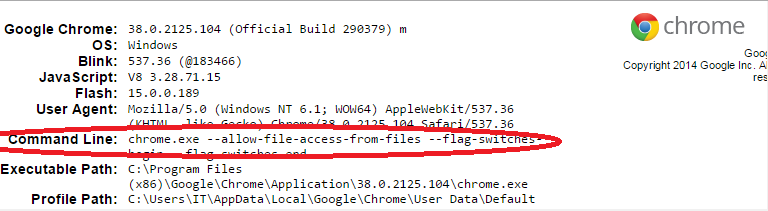
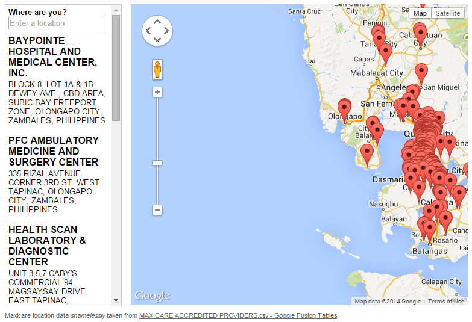

# Beyond Markers and Info Windows

### Lesson 0 - Getting Set Up

- Obtain an API key by following instructions at [developers.google.com](https://developers.google.com/maps/documentation/javascript/tutorial#api_key)
- Use your API key (by replacing API_KEY) to load Google Maps JavaScript API in [lesson-0.html](./lesson-0.html).

    <pre><code>&lt;script type="text/javascript"
                src="https://maps.googleapis.com/maps/api/js?key=<strong>API_KEY</strong>"&gt;&lt;/script&gt;
    </code></pre>

- Uncomment the JavaScript code snippet inside [lesson-0.html](./lesson-0.html) to add a map. It's near the end of the file, before the ending `</body>` tag.
- Load the HTML file and see if the map is loaded.

    Notice how the `initialize` function is called by listening to the `load` event of the window.

    ```
    <script type="text/javascript"
            src="https://maps.googleapis.com/maps/api/js?key=API_KEY"></script>
    <script type="text/javascript">
    function initialize() {
    var mapOptions = {
      center: { lat: 14.5649213, lng: 120.993946699 },
      zoom: 12
    };
    var map = new google.maps.Map(document.getElementById('map-canvas'),
        mapOptions);
    }
    google.maps.event.addDomListener(window, 'load', initialize);
    </script>
    ```

---

### Lesson 1 - Adding Marker and Info Window

- Use the results of the previous lesson as a starting point. Or, you can jump to [lesson-1.html](./lesson-1.html).
- To add a marker, create a `google.maps.Marker` in the `initialize` function. Some code was added (but commented out) to add a marker. Notice how it uses the `map` object that was created in the previous exercise.

    ```
    var dlsu = new google.maps.LatLng(14.5649213, 120.993946699);
    // To add the marker to the map, use the 'map' property
    var marker = new google.maps.Marker({
        position: dlsu,
        map: map,
        title: 'Animo La Salle!',
        icon: '...png'
    });
    ```

- To add an info window, create a `google.maps.InfoWindow` object, and use the `open` method when marker is clicked.

    ```
    // To add an infowindow, use the 'open' method when marker is clicked
    var contentString = document.getElementById('infowindow-content');
    var infowindow = new google.maps.InfoWindow({
      content: contentString
    });
    google.maps.event.addListener(marker, 'click', function() {
      infowindow.open(map, marker);
    });
    ```

- Load the HTML file again, and you should see somthing like this:

    

---

### Lesson 2 - Store locator

- In this exercise, you'll load data (from a CSV file) and display the markers on the map.
- This uses code from [storelocator.googlecode.com](http://storelocator.googlecode.com).
- As a reference, you'll be building something like [storelocator/examples/panel.html](http://storelocator.googlecode.com/git/examples/panel.html).
- To get started, include the `store-locator.min.js` file in your HTML page (use [lesson-2.html](lesson-2.html) as a starting point). It already includes Google Maps JavaScript API and jQuery.
- The following code snippet is already provided in [lesson-2.html](lesson-2.html). When the window loads, the callback function creates a new instance of the `MaxicareDataSource` object (which you will create in this exercise).

    <pre><code>google.maps.event.addDomListener(window, 'load', function() {
      var map = new google.maps.Map(document.getElementById('map-canvas'), {
        center: new google.maps.LatLng(14.5500, 121.0333),
        zoom: 8,
        mapTypeId: google.maps.MapTypeId.ROADMAP
      });

      var panelDiv = document.getElementById('panel');

      <strong style="color: #3c8ef3">var data = new MaxicareDataSource;</strong>

      var view = new storeLocator.View(map, data, {
        geolocation: false
      });

      new storeLocator.Panel(panelDiv, {
        view: view
      });
    });</code></pre>

- Add a constructor for our `MaxicareDataSource` class. This class *extends* `storeLocator.StaticDataFeed` class. In the constructor, we call `setStores` to initialize the array of store objects (as needed by the `storeLocator.StaticDataFeed` class). Note that the `maxicare-accredited-providers.csv` file has been provided. We'll define the `parse_` method in the next step.

    ```
    function MaxicareDataSource() {
      $.extend(this, new storeLocator.StaticDataFeed);

      var that = this;
      $.get('maxicare-accredited-providers.csv', function(data) {
        that.setStores(that.parse_(data));
      });
    }
    ```

    **NOTE**: To load local files (i.e. not using http://), you'll need to start your browser in a mode that allows file access to files. For Google Chrome, please follow the instructions [here](http://www.chrome-allow-file-access-from-file.com). Basically, you'll need to *shutdown all running instances of Google Chrome*, and then start it with a command line argument: **`--allow-file-access-from-files`**. To verify if this worked, go to `chrome://version` in the launched Chrome window and see if the it was indeed started with the said command line argument.

    

    You can also launch the existing [storelocator/examples/panel.html](storelocator/examples/panel.html) to test and see if the locations were loaded (i.e. markers shown on the map).

- Add a private `parse_` method to our `MaxicareDataSource` class. It shall accept a CSV file as an input argument, and shall return an array of `storeLocator.Store` objects.

    ```
    MaxicareDataSource.prototype.parse_ = function(csv) {
      var stores = [];
      return stores;
    };
    ```

- Split the CSV into rows (by splitting on `'\n'`). Next, we'll need to read headings and data rows.

    ```
    MaxicareDataSource.prototype.parse_ = function(csv) {
      var stores = [];
      var rows = csv.split('\n');
      var headings = this.parseRow_(rows[0]);

      return stores;
    };
    ```

- To parse a row, we add a private `parseRow_` method to the `MaxicareDataSource` class. We shall split on commas, and consider quoted values.

    ```
    /**
     * Very rudimentary CSV parsing - we know how this particular CSV is formatted.
     * IMPORTANT: Don't use this for general CSV parsing!
     * @private
     * @param {string} row
     * @return {Array.<string>}
     */
    MaxicareDataSource.prototype.parseRow_ = function(row) {
      var re_value = /(?!\s*$)\s*(?:'([^'\\]*(?:\\[\S\s][^'\\]*)*)'|"([^"\\]*(?:\\[\S\s][^"\\]*)*)"|([^,'"\s\\]*(?:\s+[^,'"\s\\]+)*))\s*(?:,|$)/g;
      var values = []; // Initialize array to receive values.
      row.replace(re_value, // "Walk" the string using replace with callback.
          function(m0, m1, m2, m3) {
              // Remove backslash from \' in single quoted values.
              if      (m1 !== undefined) values.push(m1.replace(/\\'/g, "'"));
              // Remove backslash from \" in double quoted values.
              else if (m2 !== undefined) values.push(m2.replace(/\\"/g, '"'));
              else if (m3 !== undefined) values.push(m3);
              return ''; // Return empty string.
          });
      // Handle special case of empty last value.
      if (/,\s*$/.test(row)) values.push('');
      return values;
    };
    ```

- Then we come back to the `parse_` method, and continue processing the data rows. By now, each row is an array of strings.

    ```
    MaxicareDataSource.prototype.parse_ = function(csv) {
      var stores = [];
      var rows = csv.split('\n');
      var headings = this.parseRow_(rows[0]);

      return stores;
    };
    ```

- For each row, we convert the array of strings into a *key-value* pair object (just like any other JavaScript object) by calling the private `toObject_` method that we will write next.

    <pre><code>MaxicareDataSource.prototype.parse_ = function(csv) {
      var stores = [];
      var rows = csv.split('\n');
      var headings = this.parseRow_(rows[0]);

      for (var i = 1, row; row = rows[i]; i++) {
        row = <strong>this.toObject_(headings, this.parseRow_(row));</strong>
      }
      return stores;
    };</code></pre>

- Add the `toObject_` method to the `MaxicareDataSource` class. Convert the array of strings to a key-value pair object. The key names come from the header row.

    ```
    MaxicareDataSource.prototype.toObject_ = function(headings, row) {
      var result = {};
      for (var i = 0, ii = row.length; i < ii; i++) {
        result[headings[i]] = row[i];
      }
      return result;
    };
    ```

- Then we come back to the `parse_` method again, and continue processing the data rows. By now, each row is an object (key-value pairs). We use the desired properties to create a `Store` object. Here, we use the GEOMETRY column for the lat/lng coordinates. It comes in the following format:

    <pre><code>&lt;Point&gt;&lt;coordinates&gt;121.014420,14.558366,0.000000&lt;/coordinates&gt;&lt;/Point&gt;
    &lt;Point&gt;&lt;coordinates&gt;<em>{longitude}</em>,<em>{latitude}</em>,0.000000&lt;/coordinates&gt;&lt;/Point&gt;
    </code></pre>

- Use a regular expression to parse out the latitude and longitude. Create a `google.maps.LatLng` object using the parsed coordinates.

    ```
    MaxicareDataSource.prototype.parse_ = function(csv) {
      var stores = [];
      var rows = csv.split('\n');
      var headings = this.parseRow_(rows[0]);

      var geometryRegEx = /.../;

      for (var i = 1, row; row = rows[i]; i++) {
        row = this.toObject_(headings, this.parseRow_(row));
        var coordinates = geometryRegEx.exec(row.GEOMETRY);

        if (coordinates && coordinates.length >= 2) {
          var position = new google.maps.LatLng(coordinates[2], coordinates[1]);
        }
      }
      return stores;
    };
    ```

- Okay, we're almost there! Using the created `google.maps.LatLng` object, together with PROVIDERCODE, PROVIDERNAME, and ADDRESS columns, we create `Store` objects and add them to an array that the `parse_` method shall return.

    ```
    MaxicareDataSource.prototype.parse_ = function(csv) {
      var stores = [];
      . . .
      for (var i = 1, row; row = rows[i]; i++) {
        row = ...;
        var coordinates = ...;

        if (coordinates && ...) {
          var position = ...;

          var store = new storeLocator.Store(row.PROVIDERCODE, position, null, {
            title: row.PROVIDERNAME,
            address: row.ADDRESS
          });
          stores.push(store);
        }
      }
      return stores;
    };
    ```

- Voila! We're almost done. Load the page and hope it works. You should see something like this.

    

