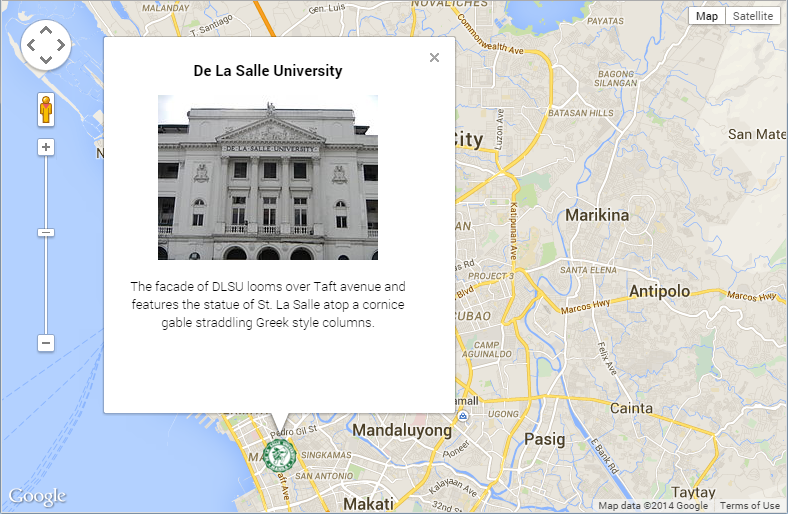

# Beyond Markers and Info Windows

### Lesson 0 - Getting Set Up

- Obtain an API key by following instructions at [developers.google.com](https://developers.google.com/maps/documentation/javascript/tutorial#api_key)
- Use your API key (by replacing API_KEY) to load Google Maps JavaScript API in [lesson-0.html](./lesson-0.html).

<pre><code>
    &lt;script type="text/javascript"
            src="https://maps.googleapis.com/maps/api/js?key=<strong>API_KEY</strong>"&gt;&lt;/script&gt;
</code></pre>

- Uncomment the JavaScript code snippet inside [lesson-0.html](./lesson-0.html) to add a map. It's near the end of the file, before the ending `</body>` tag.
- Load the HTML file and see if the map is loaded

Notice how the `initialize` function is called by listening to the `load` event of the window.

    <script type="text/javascript"
            src="https://maps.googleapis.com/maps/api/js?key=API_KEY"></script>
    <script type="text/javascript">
    function initialize() {
    var mapOptions = {
      center: { lat: 14.5649213, lng: 120.993946699 },
      zoom: 12
    };
    var map = new google.maps.Map(document.getElementById('map-canvas'),
        mapOptions);
    }
    google.maps.event.addDomListener(window, 'load', initialize);
    </script>

---

### Lesson 1 - Adding Marker and Info Window

- Use the results of the previous lesson as a starting point. Or, you can jump to [lesson-1.html](./lesson-1.html).
- To add a marker, create a `google.maps.Marker` in the `initialize` function. Some code was added (but commented out) to add a marker. Notice how it uses the `map` object that was created in the previous exercise.

```
    var dlsu = new google.maps.LatLng(14.5649213, 120.993946699);
    // To add the marker to the map, use the 'map' property
    var marker = new google.maps.Marker({
        position: dlsu,
        map: map,
        title: 'Animo La Salle!',
        icon: '...png'
    });
```

- To add an info window, create a `google.maps.InfoWindow` object, and use the `open` method when marker is clicked.

```
    // To add an infowindow, use the 'open' method when marker is clicked
    var contentString = document.getElementById('infowindow-content');
    var infowindow = new google.maps.InfoWindow({
      content: contentString
    });
    google.maps.event.addListener(marker, 'click', function() {
      infowindow.open(map, marker);
    });
```

- Load the HTML file again, and you should see somthing like this:



---

### Lesson 2 - Store locator

- In this exercise, you'll load data (from a CSV file) and display the markers on the map.
- This uses code from [storelocator.googlecode.com](http://storelocator.googlecode.com).
- As a reference, you'll be building something like [storelocator/examples/panel.html](http://storelocator.googlecode.com/git/examples/panel.html).
- To get started, include the `store-locator.min.js` file in your HTML page (use [lesson-2.html](lesson-2.html) as a starting point). It already includes Google Maps JavaScript API and jQuery.
- Add a constructor for our `MaxicareDataSource` class. This class *extends* `storeLocator.StaticDataFeed` class. In the constructor, we call `setStores` to initialize the array of store objects (as needed by the `storeLocator.StaticDataFeed` class). Note that the `maxicare-accredited-providers.csv` file has been provided. We'll define the `parse_` method in the next step.

```
function MaxicareDataSource() {
  $.extend(this, new storeLocator.StaticDataFeed);

  var that = this;
  $.get('maxicare-accredited-providers.csv', function(data) {
    that.setStores(that.parse_(data));
  });
}
```


- Add a private `parse_` method to our `MaxicareDataSource` class. It shall accept a CSV file as an input argument, and shall return an array of `storeLocator.Store` objects.

```
MaxicareDataSource.prototype.parse_ = function(csv) {
  var stores = [];
  return stores;
};
```

- Split the CSV into rows (by splitting on `'\n'`). Next, we'll need to 

```
MaxicareDataSource.prototype.parse_ = function(csv) {
  var stores = [];
  var rows = csv.split('\n');
  var headings = this.parseRow_(rows[0]);

  return stores;
};
```

  // <Point><coordinates>121.014420,14.558366,0.000000</coordinates></Point>
  var geometryRegEx = /<Point><coordinates>(\d+\.\d+),(\d+\.\d+),\d+\.\d+<\/coordinates><\/Point>/;
  for (var i = 1, row; row = rows[i]; i++) {
    row = this.toObject_(headings, this.parseRow_(row));
    /*
    var features = new storeLocator.FeatureSet;
    features.add(this.FEATURES_.getById('Wheelchair-' + row.Wheelchair));
    features.add(this.FEATURES_.getById('Audio-' + row.Audio));
    */
    var coordinates = geometryRegEx.exec(row.GEOMETRY);

    if (coordinates && coordinates.length >= 2) {
      var position = new google.maps.LatLng(coordinates[2], coordinates[1]);

      var store = new storeLocator.Store(row.PROVIDERCODE, position, null, {
        title: row.PROVIDERNAME,
        address: row.ADDRESS
      });
      stores.push(store);
    }
  }


